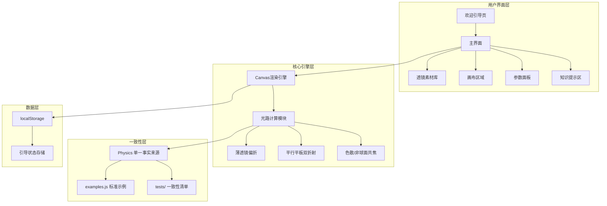
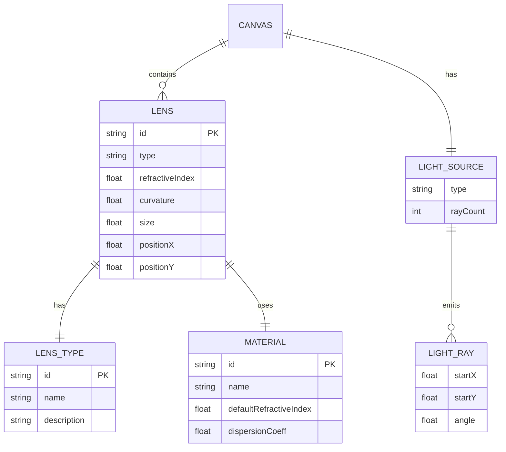
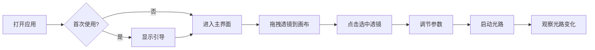

# 中学生交互式光学设计编程项目 - 设计文档

## 一、系统架构



## 二、模块关系图



## 三、核心功能模块

### 3.1 透镜类型与光路规律

| 类型 | 说明 | 光路规律 |
|------|------|----------|
| convex | 凸透镜（球面） | 光线向光轴会聚；边缘光线偏折过度，各条光线焦点错开（球差） |
| concave | 凹透镜 | 光线向外发散，反向延长线交于入射侧虚焦点（f 为负） |
| plano | 平面透镜（平行平板） | 出射方向与入射方向一致；垂直入射无侧移，斜入射有微小侧移 |
| aspheric | 非球面透镜 | 所有平行光线严格会聚到同一焦点（消除球差） |

### 3.2 材料类型

| 材料 | 折射率 | 色散系数 | 说明 |
|------|--------|---------|------|
| normal | 1.5 | 0.3 | 普通玻璃 |
| highIndex | 1.7 | 0.25 | 高折射率，更薄更强聚光 |
| lowDispersion | 1.52 | 0.1 | 低色散，减少彩虹光斑 |

## 四、UI/UX 规范

### 4.1 色彩体系

- 主色调: #4A90E2 (蓝色)
- 强调色: #5D7A3A (低饱和绿)
- 页面背景: #F5F2EB (浅米白)
- 卡片背景: #FFFFFF
- 主文本: #333333
- 次文本: #666666
- 成功色: #4A5D23
- 错误色: #783F27

### 4.2 字体规范

- 中文: 思源黑体 / 系统默认无衬线体
- 标题: 18-20px, 字重700
- 正文: 14-16px, 字重500
- 辅助文字: 12px, 字重400

### 4.3 间距规范

- 基础单位: 8px
- 小间距: 8px
- 中间距: 16px
- 大间距: 24px
- 卡片圆角: 8px

### 4.4 交互规范

- 可点击区域: ≥44px × 44px (移动端≥48px)
- 过渡动画: 0.3s ease
- 光路更新: 实时

## 五、响应式断点

| 设备 | 断点 | 布局 |
|------|------|------|
| 手机 | <768px | 纵向布局 |
| 平板 | 768px-1024px | 纵向布局 |
| 电脑 | >1024px | 横向布局 |

## 六、文件结构

```
frontend-user/
├── index.html          # 主入口
├── Dockerfile          # Docker配置
├── css/
│   ├── reset.css       # 样式重置
│   ├── variables.css   # CSS变量
│   ├── layout.css      # 布局样式
│   ├── components.css  # 组件样式
│   └── responsive.css  # 响应式样式
└── js/
    ├── app.js          # 应用入口
    ├── config.js       # 配置常量（题目、帮助文案）
    ├── examples.js     # 标准示例数据（共用唯一清单）
    ├── storage.js      # 本地存储
    ├── guide.js        # 引导系统
    ├── canvas.js       # 画布管理
    ├── renderer.js     # 光路渲染（只调用 Physics）
    ├── physics.js      # 物理计算（唯一事实来源）
    ├── interaction.js  # 交互处理
    └── utils.js        # 工具函数
tests/
    ├── consistency-check.js  # 文案/物理/示例一致性清单
    ├── quiz-solvable-check.js# 每道题标准解可通过
    └── smoke-check.js        # 模拟 DOM 接线冒烟
package.json          # npm test 与 Docker 构建共用
```

## 七、核心交互流程



## 八、光路计算原理

渲染器（renderer.js）、题目校验（quiz.js）、焦距标注与测试脚本都只调用
`Physics` 这一套 API，不允许各自实现规则。

### 8.1 薄透镜（凸/凹/非球面）

光线在主平面发生一次偏折（h 为入射点相对光轴距离）：

```
tan θ' = tan θ − h / f(h)
f0 = FOCAL_CONSTANT / ((n − 1) × 曲率/100)
```

- 凸透镜（球面）：f(h) = f0 / (1 + S·(h/a)⁴)，S 随曲率增大，
  边缘有效焦距更短 → 边缘光线过度偏折 → 球差可见；
- 非球面透镜：f(h) = f0，所有平行光线严格交于同一焦点；
- 凹透镜：f = −f0，交点在入射侧，为虚焦点。

### 8.2 平面透镜（有厚度的平行平板）

按两个表面各折射一次追踪：

```
sin r = sin i / n
侧移 = 板厚 × (tan i − tan r)
```

垂直入射 i=0 时侧移为 0；斜入射时出射方向恢复为入射方向，仅平移一段。

### 8.3 色散（柯西公式教学版，λ 以 μm 计）

```
n(λ) = n_d + K·dispersion·(1/λ² − 1/λ_d²)
```

蓝光折射率最大、焦距最短（焦点最靠近透镜），红光反之；
低色散镜片 dispersion 很小，三色焦点几乎重合。

### 8.4 一致性自检

`js/examples.js` 是题目、帮助、画布与测试共用的唯一示例清单，
`tests/` 下三份脚本在 `npm test` 与 Docker 构建阶段都会运行。
