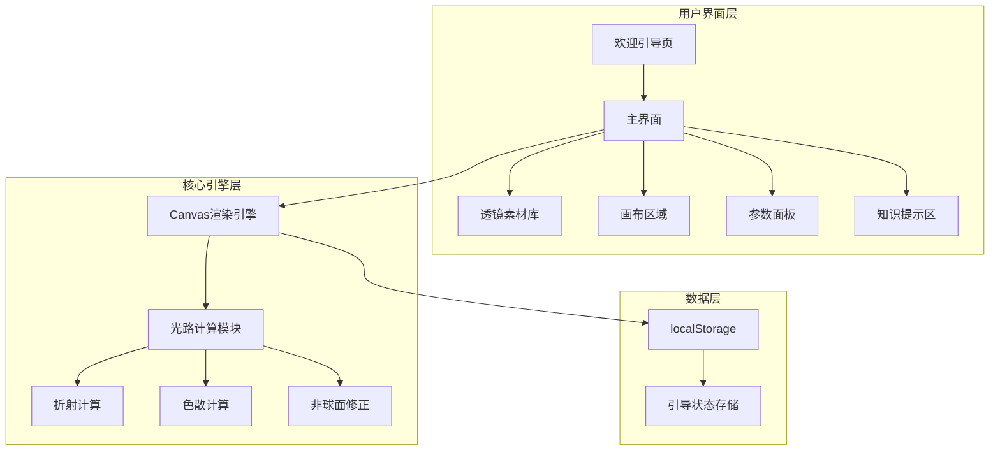
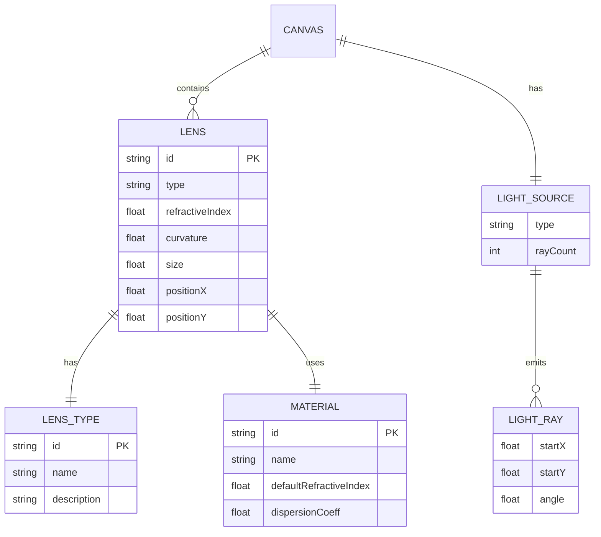
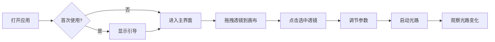

# 中学生交互式光学设计编程项目 - 设计文档

## 一、系统架构



## 二、模块关系图



## 三、核心功能模块

### 3.1 透镜类型与光路规律

| 类型 | 说明 | 光路规律 |
|------|------|----------|
| convex | 凸透镜 | 光线向光轴会聚；边缘光线因球差会聚在稍靠近透镜处 |
| concave | 凹透镜 | 光线向外发散，反向延长线交于虚焦点 |
| plano | 平面透镜 | 垂直入射不偏折不侧移；斜入射侧移，出射与入射平行 |
| aspheric | 非球面透镜 | 各条平行光线精准汇聚到同一焦点，消除球差 |

### 3.2 材料类型

色散系数为教学放大模型，保证红/绿/蓝焦点差异在画布上可见：

| 材料 | 折射率 | 色散系数 | 说明 |
|------|--------|---------|------|
| normal | 1.5 | 0.072 | 普通玻璃，三色焦点分离明显 |
| highIndex | 1.7 | 0.06 | 高折射率，焦距更短，色散较明显 |
| lowDispersion | 1.52 | 0.003 | 低色散（ED），三色焦点几乎重合 |

## 四、UI/UX 规范

### 4.1 色彩体系

- 主色调: #4A90E2 (蓝色)
- 强调色: #5D7A3A (低饱和绿)
- 页面背景: #F5F2EB (浅米白)
- 卡片背景: #FFFFFF
- 主文本: #333333
- 次文本: #666666
- 成功色: #4A5D23
- 错误色: #783F27

### 4.2 字体规范

- 中文: 思源黑体 / 系统默认无衬线体
- 标题: 18-20px, 字重700
- 正文: 14-16px, 字重500
- 辅助文字: 12px, 字重400

### 4.3 间距规范

- 基础单位: 8px
- 小间距: 8px
- 中间距: 16px
- 大间距: 24px
- 卡片圆角: 8px

### 4.4 交互规范

- 可点击区域: ≥44px × 44px (移动端≥48px)
- 过渡动画: 0.3s ease
- 光路更新: 实时

## 五、响应式断点

| 设备 | 断点 | 布局 |
|------|------|------|
| 手机 | <768px | 纵向布局 |
| 平板 | 768px-1024px | 纵向布局 |
| 电脑 | >1024px | 横向布局 |

## 六、文件结构

```
frontend-user/
├── index.html          # 主入口
├── Dockerfile          # Docker配置
├── css/
│   ├── reset.css       # 样式重置
│   ├── variables.css   # CSS变量
│   ├── layout.css      # 布局样式
│   ├── components.css  # 组件样式
│   └── responsive.css  # 响应式样式
└── js/
    ├── app.js          # 应用入口
    ├── spec.js         # 统一规则与示例数据清单（文案/画布/测试共用）
    ├── config.js       # 配置常量（帮助文案引用 spec 的规则）
    ├── storage.js      # 本地存储
    ├── guide.js        # 引导系统
    ├── canvas.js       # 画布管理
    ├── renderer.js     # 光路渲染（调用 Physics.traceRay）
    ├── physics.js      # 物理计算（渲染与测验判定共用）
    ├── quiz.js         # 测验判定（基于 Physics 分析结果）
    ├── interaction.js  # 交互处理
    └── utils.js        # 工具函数
```

校验：仓库根目录 `npm test`（`tests/optics.test.js`），Docker 构建阶段同样执行。

## 七、核心交互流程



## 八、光路计算原理

> 统一规则与示例数据见 `frontend-user/js/spec.js`，画布渲染、测验判定与自动测试
> （`tests/optics.test.js`）共用同一实现。

### 8.1 核心规律

- 凸透镜：薄透镜偏折 + 球差，边缘光线额外向光轴偏折
- 凹透镜：光线向外发散，反向延长线交于虚焦点
- 平面透镜：真实平行平板（两次折射），垂直入射不偏折不侧移，斜入射只侧移
- 非球面：按近轴焦距精确瞄准，所有平行光线交于同一焦点

### 8.2 偏折角度计算

```javascript
// 光焦度 P 与近轴焦距 F（半高 H = 透镜口径/2）
P = (refractiveIndex - 1) * (curvature / 100)
F = H / P

// 凸透镜（rel 为光线在口径上的相对高度，-1~1）：近轴项 + 球差项
deflection = -rel * P - sign(rel) * P * 0.22 * rel²

// 凹透镜：远离光轴
deflection = +rel * P

// 非球面：精确瞄准焦点 (x + F, y_axis)
deflection = -atan(rel * P)
```

### 8.3 平面透镜（平行平板）

- 空气→玻璃→空气两次应用折射定律 `n1 sinθ1 = n2 sinθ2`
- 两表面平行 ⇒ 出射角严格等于入射角（方向不变）
- 斜入射时出射光相对原方向产生侧移，厚度/角度越大侧移越明显

### 8.4 色散模型

柯西公式 n(λ) = n0 + B(1/λ² − 1/λ0²)（B 为教学放大系数）：
- 蓝光折射率最大、焦距最短（焦点最靠近透镜）
- 红光折射率最小、焦距最长
- 低色散镜片 B 很小，三色焦点几乎重合
- 开启“色散”后，光轴上分别绘制红/绿/蓝焦点刻度
